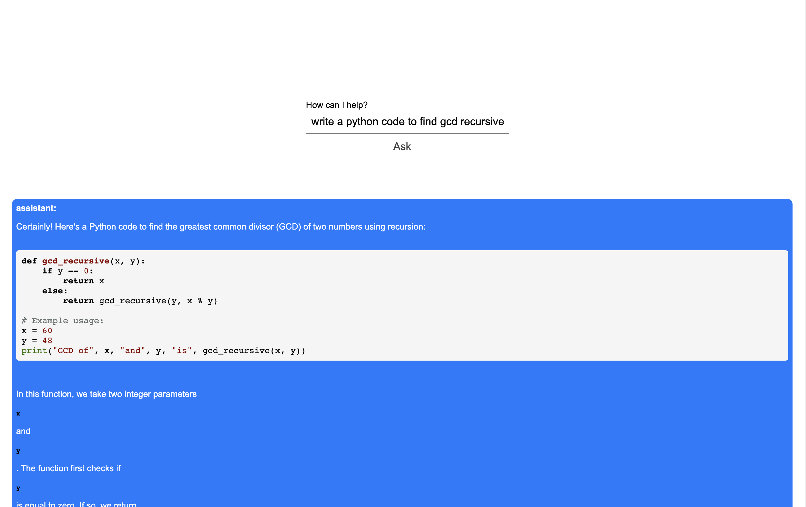

### 1. Clone this first
### 2. Put your own OpenAI API keys in rendered.js
### 3. Install dependencies

#### Install openai clack/prompts and electron
`npm install electron-packager`
`npm install electron @clack/prompts openai`

#### Install highlight js
`npm install highlight.js`

#### Start the application in debug mode
`npm start`

-- After debugging is done

### create a release build for macOS
`npx electron-packager . --overwrite --platform=darwin --arch=x64 --prune=true --out=release-builds`

### Open released app
`open release-builds/deskchat-darwin-x64/deskchat_app.app`

